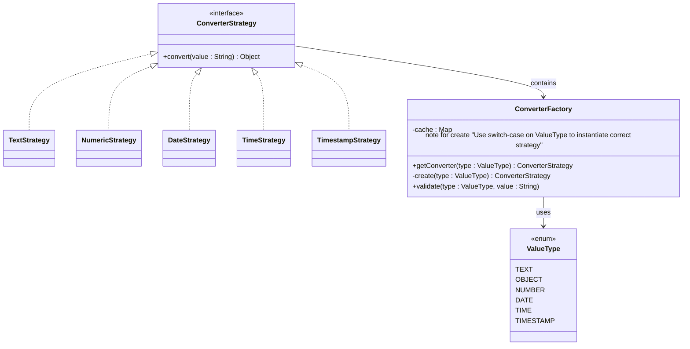
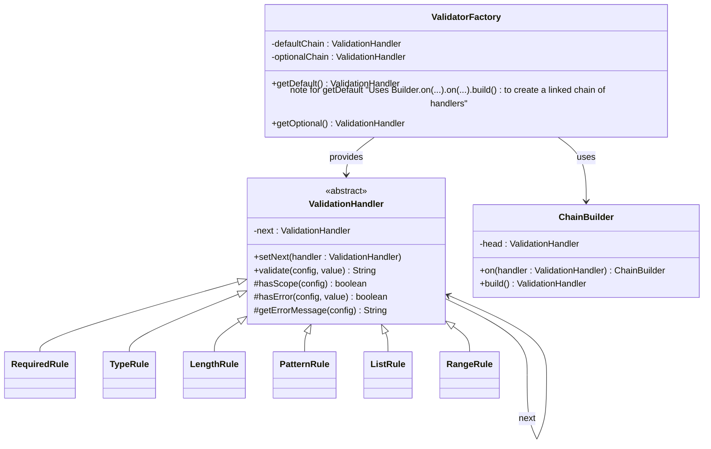

1. Applying a Factory + Strategy pattern combination
- Strategy Pattern → different converters implement a common interface
- Factory Pattern → creates and manages converter instances based on type (with caching)

=> used in converter

2. Applying `Chain of responsibility` combined with `Factory` and `Builder Pattern`
- Chain of responsibility Pattern → organizes multiple validators into a chain (like a linked list), where each validator processes the request or passes it to the next one
- Factory Pattern → responsible for creating and providing preconfigured validator chains (and optionally caching/reusing them).
- Builder Pattern -> used to fluently construct the validator chain step-by-step (linking handlers together in order).

=> used in validator