# Audit Flow Documentation

## Overview

This document describes the audit flow across three components: the **MainApplication**, the **AuditLibrary**, and the **audit sending plugin JARs**.

The following properties are defined in `application.properties` of the main application:

| Property | Values | Description |
|---|---|---|
| `audit.enable` | `true` / `false` | Enables both the multi-datasource and audit features simultaneously |
| `audit.list-data-source` | e.g. `datasource1,datasource2` | Comma-separated list of datasource names; the first one is treated as default |
| `audit.storing.type` | `jdbc` / `redis` / `rabbitmq` / ... | Determines where audit logs are stored |
| `audit.sending.type` | `rest` / `queue` / ... | Determines how audit logs are sent out |

---

## Step 1: Multi-Datasource & Audit Configuration

### AuditLibrary

The library uses `AbstractRoutingDataSource` to manage multiple datasources when `audit.enable=true`.

#### Custom Conditional Classes

Rather than relying on `@ConditionalOnProperty`, we define two custom `Condition` implementations to handle more complex conditional logic:

- `AuditEnable` — implements `Condition`; the `matches(...)` method returns `true` when audit is enabled
- `AuditDisable` — implements `Condition`; the inverse of `AuditEnable`

Use `@Conditional(AuditEnable.class)` or `@Conditional(AuditDisable.class)` to control whether a bean gets registered.

#### `ContextHolder`

```
@Component
@Conditional(AuditEnable.class)
```

A thread-safe holder for tracking which datasource the current request is using:

- `static ThreadLocal<String>` — stores the active datasource name per thread
- `set(String dataSourceName)` — sets the active datasource
- `getUsingDatabase()` — returns the active datasource name
- `clear()` — cleans up after the request

#### `DataSourceRouter`

```
@Component
@Conditional(AuditEnable.class)
@EnableTransactionManagement
@EnableJpaRepositories(basePackages = "com.a.b.c.audit")
@EntityScan(basePackages = "com.a.b.c.audit")
```

Extends `AbstractRoutingDataSource`. This becomes the `@Primary` datasource bean. Let's define new bean DataSours with @Primary

**Constructor logic:**
1. Reads the datasource name list from `audit.list-data-source`
2. For each name, fetches the corresponding bean and casts it to `DataSource`
3. Builds a `Map<Object, Object>` of `{ dataSourceName → DataSource }`
4. Calls `setTargetDataSources(...)` with that map
5. Calls `setDefaultTargetDataSource(...)` with the first datasource in the list

**`determineCurrentLookupKey()`** — returns `ContextHolder.getUsingDatabase()` to route each request to the correct datasource.

> The `@EnableJpaRepositories` and `@EntityScan` annotations are required to register the audit-specific JPA repositories and entities under `com.a.b.c.audit`.

#### Audit Service

- `AuditService` — interface defining the contract for saving audit logs
- `DatabaseAuditService` — `@Service` that saves audit logs to the configured store (DB, Redis, etc.)
- `DefaultAuditService` — `@Service` that simply logs or does nothing (used when audit is disabled)

#### `AuditConfig` and `DefaultAuditConfig`

**`AuditConfig`** (`@Conditional(AuditEnable.class)`):
- Registers `AuditService` bean backed by `DatabaseAuditService`
- Defines a `DataSourceProperties` bean via `@ConfigurationProperties` (pointing to the library's datasource config)
- Defines a `DataSource` bean based on `DataSourceProperties` bean and Hikari config
- Exposes a static method returning the datasource name (e.g., `dataSourceName2`)

**`DefaultAuditConfig`** (`@Conditional(AuditDisable.class)`):
- Registers `AuditService` bean backed by `DefaultAuditService`
- No datasource bean needed here

#### `@EnableAudit`

A custom annotation that uses `@Import` to bring in the above config beans. Simply annotating your main application class with `@EnableAudit` is enough to wire up all audit-related beans, respecting the `@Conditional` logic.

---

### MainApplication

#### `@EnableAudit`

Add this to your main application class to activate the audit setup from the library.

#### `DataSourceConfig`

```
@Configuration
@EnableJpaRepositories(basePackages = "com.a.b.c.main")
@EntityScan(basePackages = "com.a.b.c.main")
```

- Exposes a static method returning the datasource name (e.g., `dataSourceName1`)
- Defines `DataSourceProperties` via `@ConfigurationProperties` (main app's datasource config)
- Defines a `DataSource` bean from above `DataSourceProperties` and Hikari config

#### `WebConfig`

```
@Component
```

Implements `WebMvcConfigurer`. Overrides `addInterceptors(InterceptorRegistry)` to register the appropriate `HandlerInterceptor` bean.

#### Interceptors

**`AuditInterceptor`** (`@Conditional(AuditEnable.class)`):
- In `afterCompletion(...)`, collects audit log data and calls `AuditService.save(auditLog)`
- For APIs where the audit log content varies, intermediate data is stored in the request via `request.setAttribute(...)` during processing, then read, assembled, and forwarded to `AuditService` in the interceptor
- After sending, all custom attributes are cleaned up from `HttpServletRequest`

**`DefaultInterceptor`** (`@Conditional(AuditDisable.class)`):
- In `afterCompletion(...)`, just logs or does nothing

---

## Step 2: Audit Sending Plugins

The library defines an `AuditSending` interface. Each plugin JAR provides its own implementation of this interface (e.g., REST sender, queue sender, etc.).

In the library, a bean is defined that scans the classpath for any class implementing `AuditSending` (including those from plugin JARs) and registers them as Spring beans automatically. This makes it easy to add new sending strategies without modifying the core library.

---

## Step 3: Retry & Scheduled Sending

### Retry Configuration

Inside `AuditConfig`, a `RetryTemplate` bean is defined with the following settings:

- `maxAttempts` — maximum number of retry attempts
- `backOffPeriod` — wait time between retries
- `retryPolicy` — uses `SimpleRetryPolicy`
- `backOffPolicy` — uses `FixedBackOffPolicy`

### Scheduled Job

The library runs a scheduled job that pulls unsent audit logs from Redis or the database and forwards them via `AuditSending`. The fetching strategy works as follows:

```
offset = 0
do {
    auditLogs = fetch(offset, limit)  // batchSize = limit

    try {
        retryTemplate.execute(() -> auditSending.send(auditLogs))
    } catch (Exception e) {
        offset += limit  // skip this batch and move on
    }

} while (auditLogs.size() >= batchSize)
```

- A `do-while` loop fetches logs in pages using `offset` and `limit`
- Each batch is sent through `RetryTemplate.execute(...)` wrapping `AuditSending.send(...)`
- If a batch fails after all retries, the offset advances and the job continues with the next batch
- Any batches that ultimately fail will be retried by the **next scheduled job run**

```mermaid
---
title: Audit Flow - Class Diagram
---
classDiagram

%% ============================================================
%% SPRING / EXTERNAL FRAMEWORK INTERFACES & CLASSES
%% These are provided by Spring Framework, not custom code.
%% ============================================================

    class Condition {
        <<interface>>
        %% Spring's SPI for programmatic bean registration control.
        %% Implement this to decide at runtime whether a bean should be created.
        +matches(ConditionContext, AnnotatedTypeMetadata) boolean
    }

    class AbstractRoutingDataSource {
        <<abstract>>
        %% Spring's built-in datasource router.
        %% Subclass this and implement determineCurrentLookupKey()
        %% to dynamically switch between multiple DataSource beans per request.
        +setTargetDataSources(Map) void
        +setDefaultTargetDataSource(Object) void
        #determineCurrentLookupKey()* Object
    }

    class HandlerInterceptor {
        <<interface>>
        %% Spring MVC interceptor hook.
        %% preHandle runs before the controller.
        %% postHandle runs after the controller but before view rendering.
        %% afterCompletion runs after the full request is done (used here for audit logging).
        +preHandle(request, response, handler) boolean
        +postHandle(request, response, handler, mv) void
        +afterCompletion(request, response, handler, ex) void
    }

    class WebMvcConfigurer {
        <<interface>>
        %% Spring MVC configuration hook.
        %% Implement addInterceptors() to register custom HandlerInterceptors
        %% into the interceptor chain without replacing the default config.
        +addInterceptors(InterceptorRegistry) void
    }

    class RetryTemplate {
        <<Spring Retry>>
        %% Provided by spring-retry library.
        %% Wraps any callable with retry logic based on configured policies.
        %% Used here to retry AuditSending.send() on transient failures.
        -retryPolicy : SimpleRetryPolicy
        -backOffPolicy : FixedBackOffPolicy
        +execute(RetryCallback) T
    }

    class SimpleRetryPolicy {
        <<Spring Retry>>
        %% Retries up to maxAttempts times on any exception.
        -maxAttempts : int
    }

    class FixedBackOffPolicy {
        <<Spring Retry>>
        %% Waits a fixed number of milliseconds between each retry attempt.
        -backOffPeriod : long
    }

%% ============================================================
%% AUDIT LIBRARY — CONDITIONAL CLASSES
%% These control which beans get registered based on audit.enable property.
%% ============================================================

    class AuditEnable {
        <<Condition>>
        %% Custom Condition that returns true when audit.enable=true.
        %% Used with @Conditional(AuditEnable.class) to activate audit beans.
        %% More flexible than @ConditionalOnProperty for complex logic.
        +matches(ConditionContext, AnnotatedTypeMetadata) boolean
    }

    class AuditDisable {
        <<Condition>>
        %% Custom Condition that returns true when audit.enable=false.
        %% Used with @Conditional(AuditDisable.class) to activate fallback beans.
        %% Acts as the logical inverse of AuditEnable.
        +matches(ConditionContext, AnnotatedTypeMetadata) boolean
    }

%% ============================================================
%% AUDIT LIBRARY — CONTEXT & ROUTING
%% ============================================================

    class ContextHolder {
        <<Component>>
        %% @Conditional(AuditEnable)
        %% Thread-local store for the active datasource name.
        %% Each HTTP request thread independently tracks which datasource it should use.
        %% Must be cleared after each request to prevent thread pool leaks.
        -dataSourceName : ThreadLocal~String$~
        +set(dataSourceName : String) void
        +getUsingDatabase() String
        +clear() void
    }

    class DataSourceRouter {
        <<Component, Primary>>
        %% @Conditional(AuditEnable)
        %% @EnableTransactionManagement
        %% @EnableJpaRepositories(basePackages="com.a.b.c.audit")
        %% @EntityScan(basePackages="com.a.b.c.audit")
        %% The @Primary DataSource bean when audit is enabled.
        %% On construction, reads all datasource names from audit.list-data-source,
        %% looks up their Spring beans, and registers them as routing targets.
        %% The first datasource in the list becomes the default.
        %% determineCurrentLookupKey() delegates to ContextHolder so each
        %% request is routed to whichever datasource was set on the current thread.
        %% @EnableJpaRepositories + @EntityScan are required here (not in a separate
        %% @Configuration class) so Spring wires the audit JPA layer through this
        %% router rather than a plain DataSource.
        -targetSources : Map~Object, Object~
        +DataSourceRouter(applicationContext : ApplicationContext)
        #determineCurrentLookupKey() Object
    }

%% ============================================================
%% AUDIT LIBRARY — SERVICE LAYER
%% ============================================================

    class AuditService {
        <<interface>>
        %% Core contract for persisting an audit log entry.
        %% Two implementations exist: one for real storage, one as a no-op fallback.
        +save(auditLog : AuditLog) void
    }

    class DatabaseAuditService {
        <<Service>>
        %% Active when audit.enable=true (registered by AuditConfig).
        %% Persists audit logs to the configured store:
        %%   - audit.storing.type=jdbc  → relational database
        %%   - audit.storing.type=redis → Redis cache
        %%   - audit.storing.type=rabbitmq → message queue
        +save(auditLog : AuditLog) void
    }

    class DefaultAuditService {
        <<Service>>
        %% Active when audit.enable=false (registered by DefaultAuditConfig).
        %% No-op implementation: just logs or silently discards the audit entry.
        %% Ensures AuditService can always be injected without null checks.
        +save(auditLog : AuditLog) void
    }

%% ============================================================
%% AUDIT LIBRARY — CONFIGURATION BEANS
%% ============================================================

    class AuditConfig {
        <<Configuration>>
        %% @Conditional(AuditEnable)
        %% Main audit config, active only when audit is enabled.
        %% Responsibilities:
        %%   1. Registers AuditService bean → DatabaseAuditService
        %%   2. Defines the audit library's own DataSource (datasource2)
        %%      via @ConfigurationProperties + HikariCP config
        %%   3. Defines RetryTemplate bean for the scheduled sender (Step 3)
        %% The static getDataSourceName() method lets DataSourceRouter
        %% look up this datasource by a well-known key at construction time.
        +auditService() AuditService
        +dataSourceProperties() DataSourceProperties
        +dataSource(props : DataSourceProperties) DataSource
        +retryTemplate() RetryTemplate
        +getDataSourceName()$ String
    }

    class DefaultAuditConfig {
        <<Configuration>>
        %% @Conditional(AuditDisable)
        %% Fallback config when audit is disabled.
        %% Only registers AuditService → DefaultAuditService.
        %% No DataSource bean is needed because the router is also disabled.
        +auditService() AuditService
    }

    class EnableAudit {
        <<Annotation>>
        %% Custom meta-annotation that @Imports AuditConfig and DefaultAuditConfig.
        %% Add @EnableAudit to the main application class to activate the entire
        %% audit subsystem. Each config bean self-selects via @Conditional,
        %% so only the appropriate beans are registered at startup.
    }

%% ============================================================
%% AUDIT LIBRARY — SENDING PLUGIN SYSTEM (Step 2)
%% ============================================================

    class AuditSending {
        <<interface>>
        %% Plugin SPI for audit log delivery.
        %% Each plugin JAR ships one implementation of this interface.
        %% The library auto-scans the classpath and registers all
        %% AuditSending implementations as Spring beans, so adding a new
        %% transport (REST, Kafka, etc.) requires no library changes.
        +send(auditLogs : List~AuditLog~) void
    }

    class RestAuditSender {
        <<Plugin JAR>>
        %% Example plugin: sends audit logs via HTTP REST call.
        %% Activated when audit.sending.type=rest.
        +send(auditLogs : List~AuditLog~) void
    }

    class QueueAuditSender {
        <<Plugin JAR>>
        %% Example plugin: publishes audit logs to a message queue (e.g. RabbitMQ).
        %% Activated when audit.sending.type=queue.
        +send(auditLogs : List~AuditLog~) void
    }

%% ============================================================
%% AUDIT LIBRARY — SCHEDULED JOB (Step 3)
%% ============================================================

    class AuditScheduledJob {
        <<Component, Scheduled>>
        %% Runs on a fixed schedule to flush pending audit logs to the external target.
        %% Fetches logs from the store (DB or Redis) in paginated batches and
        %% delegates to AuditSending via RetryTemplate.
        %% Batch loop strategy (do-while with offset/limit):
        %%   - Fetches one page of logs at a time.
        %%   - Retries each batch via RetryTemplate before giving up.
        %%   - On failure, advances offset and continues with the next batch
        %%     so one bad batch doesn't block the rest.
        %%   - Failed batches remain in the store and are retried on the next run.
        %%   - Loop exits when a page returns fewer rows than batchSize,
        %%     indicating no more pending logs.
        -auditSending : AuditSending
        -retryTemplate : RetryTemplate
        -batchSize : int
        +runSendJob() void
        -fetchBatch(offset : int, limit : int) List~AuditLog~
    }

%% ============================================================
%% MAIN APPLICATION — CONFIGURATION
%% ============================================================

    class MainApplication {
        <<SpringBootApplication>>
        %% @EnableAudit
        %% Entry point. @EnableAudit triggers import of AuditConfig / DefaultAuditConfig.
        %% The audit subsystem activates or stays dormant based on audit.enable property.
    }

    class DataSourceConfig {
        <<Configuration>>
        %% @EnableJpaRepositories(basePackages="com.a.b.c.main")
        %% @EntityScan(basePackages="com.a.b.c.main")
        %% Configures the main application's own datasource (datasource1).
        %% This datasource is the default target inside DataSourceRouter.
        %% Static getDataSourceName() gives DataSourceRouter a stable key
        %% to reference this datasource during router construction.
        +dataSourceProperties() DataSourceProperties
        +dataSource(props : DataSourceProperties) DataSource
        +getDataSourceName()$ String
    }

    class WebConfig {
        <<Component>>
        %% Implements WebMvcConfigurer to plug interceptors into Spring MVC.
        %% Registers either AuditInterceptor or DefaultInterceptor depending
        %% on which bean was created (controlled by @Conditional on each interceptor).
        +addInterceptors(registry : InterceptorRegistry) void
    }

%% ============================================================
%% MAIN APPLICATION — INTERCEPTORS
%% ============================================================

    class AuditInterceptor {
        <<Component>>
        %% @Conditional(AuditEnable)
        %% Active interceptor when audit is enabled.
        %% afterCompletion() is the main hook:
        %%   1. Reads any audit attributes set on the request via request.getAttribute()
        %%      (controllers store per-API audit context this way)
        %%   2. Assembles the full AuditLog object
        %%   3. Calls AuditService.save(auditLog) to persist it
        %%   4. Cleans up all custom attributes from HttpServletRequest
        %%      to avoid polluting the thread-local request state
        -auditService : AuditService
        +afterCompletion(request, response, handler, ex) void
    }

    class DefaultInterceptor {
        <<Component>>
        %% @Conditional(AuditDisable)
        %% Fallback interceptor when audit is disabled.
        %% afterCompletion() either logs minimally or does nothing.
        %% Ensures WebConfig always has a valid HandlerInterceptor to register.
        +afterCompletion(request, response, handler, ex) void
    }

%% ============================================================
%% RELATIONSHIPS
%% ============================================================

    %% Condition implementations
    Condition <|.. AuditEnable : implements
    Condition <|.. AuditDisable : implements

    %% DataSourceRouter extends Spring's AbstractRoutingDataSource
    AbstractRoutingDataSource <|-- DataSourceRouter : extends

    %% DataSourceRouter reads the active datasource name from ContextHolder
    DataSourceRouter --> ContextHolder : reads lookup key via getUsingDatabase()

    %% AuditService implementations
    AuditService <|.. DatabaseAuditService : implements
    AuditService <|.. DefaultAuditService  : implements

    %% AuditConfig wires DatabaseAuditService and owns RetryTemplate
    AuditConfig ..> DatabaseAuditService  : registers bean
    AuditConfig ..> RetryTemplate         : defines bean
    AuditConfig *-- RetryTemplate         : configures

    %% RetryTemplate is composed of policies
    RetryTemplate *-- SimpleRetryPolicy   : retryPolicy
    RetryTemplate *-- FixedBackOffPolicy  : backOffPolicy

    %% DefaultAuditConfig wires DefaultAuditService
    DefaultAuditConfig ..> DefaultAuditService : registers bean

    %% EnableAudit imports both configs
    EnableAudit ..> AuditConfig        : @Import
    EnableAudit ..> DefaultAuditConfig : @Import

    %% MainApplication uses @EnableAudit
    MainApplication ..> EnableAudit : annotated with

    %% AuditSending plugin implementations
    AuditSending <|.. RestAuditSender  : implements (plugin JAR)
    AuditSending <|.. QueueAuditSender : implements (plugin JAR)

    %% Scheduled job depends on AuditSending and RetryTemplate
    AuditScheduledJob --> AuditSending  : delegates send()
    AuditScheduledJob --> RetryTemplate : wraps send() with retry

    %% WebConfig registers interceptors
    WebMvcConfigurer <|.. WebConfig : implements
    WebConfig --> AuditInterceptor   : registers (if AuditEnable)
    WebConfig --> DefaultInterceptor : registers (if AuditDisable)

    %% Interceptors implement HandlerInterceptor
    HandlerInterceptor <|.. AuditInterceptor   : implements
    HandlerInterceptor <|.. DefaultInterceptor : implements

    %% AuditInterceptor calls AuditService
    AuditInterceptor --> AuditService : save(auditLog)

    %% DataSourceConfig is used by DataSourceRouter at construction
    DataSourceConfig ..> DataSourceRouter : provides datasource1 to router map
```

