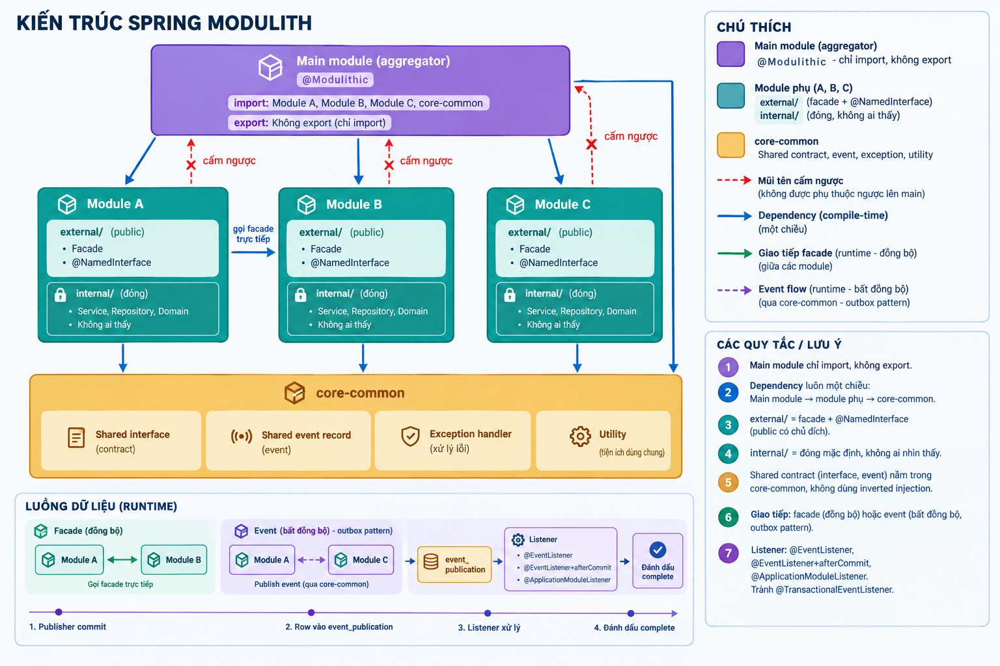
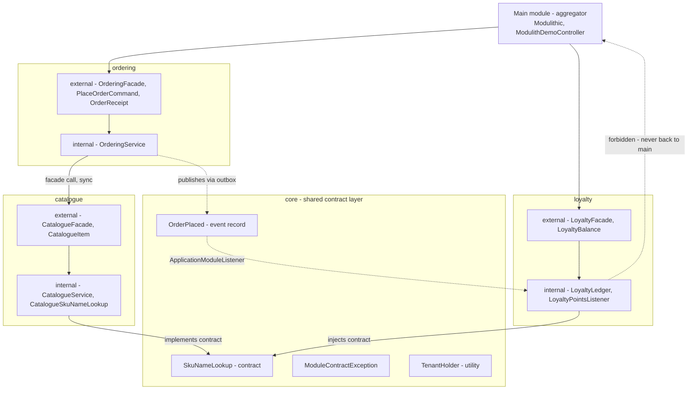

# Spring Modulith: how do you structure a modular monolith in Spring Boot?

Applied in [project2](../../../project2) (Web + JPA + PostgreSQL — the outbox needs a real relational
store, and this is the module that has one).
Every snippet below is real code — the link above each block opens the file it came from, and each
of those files carries an `Interview topic:` back-link to the section here.

| Section | Code in project2 |
|---|---|
| [Answer](#answer) | [`pom.xml`](../../../project2/pom.xml) |
| [The 7 principles](#the-7-principles) | [`modulith/`](../../../project2/src/main/java/com/example/project2/modulith) |
| [Architecture](#architecture) | diagram + package layout |
| [Config](#config) | [`application.properties`](../../../project2/src/main/resources/application.properties) |
| [Main module (aggregator)](#main-module-aggregator) | [`ModulithSlice.java`](../../../project2/src/main/java/com/example/project2/modulith/ModulithSlice.java), [`ModulithDemoController.java`](../../../project2/src/main/java/com/example/project2/controller/ModulithDemoController.java) |
| [One-way dependencies](#one-way-dependencies) | [`ordering/package-info.java`](../../../project2/src/main/java/com/example/project2/modulith/ordering/package-info.java) |
| [core-common: the shared contract layer](#core-common-the-shared-contract-layer) | [`SkuNameLookup.java`](../../../project2/src/main/java/com/example/project2/modulith/core/SkuNameLookup.java), [`CatalogueSkuNameLookup.java`](../../../project2/src/main/java/com/example/project2/modulith/catalogue/internal/CatalogueSkuNameLookup.java) |
| [external/internal inside a module](#externalinternal-inside-a-module) | [`catalogue/external/package-info.java`](../../../project2/src/main/java/com/example/project2/modulith/catalogue/external/package-info.java), [`CatalogueService.java`](../../../project2/src/main/java/com/example/project2/modulith/catalogue/internal/CatalogueService.java) |
| [Facade (sync)](#facade-sync) | [`CatalogueFacade.java`](../../../project2/src/main/java/com/example/project2/modulith/catalogue/external/CatalogueFacade.java), [`OrderingService.java`](../../../project2/src/main/java/com/example/project2/modulith/ordering/internal/OrderingService.java) |
| [Event-driven (async)](#event-driven-async) | [`OrderPlaced.java`](../../../project2/src/main/java/com/example/project2/modulith/core/OrderPlaced.java), [`LoyaltyPointsListener.java`](../../../project2/src/main/java/com/example/project2/modulith/loyalty/internal/LoyaltyPointsListener.java) |
| [The outbox](#the-outbox) | [`application.properties`](../../../project2/src/main/resources/application.properties) |
| [Verifying the boundaries](#verifying-the-boundaries) | [`ModulithArchitectureTest.java`](../../../project2/src/test/java/com/example/project2/modulith/ModulithArchitectureTest.java) |

## Answer

A modular monolith is one deployable with enforced internal borders. Spring Modulith treats each
direct sub-package of the application root as a module, exports only what you mark as public, and
fails the build when someone reaches into another module's internals. You get the boundaries of
microservices without the network, and any module can later be lifted out as a service.

[`project2/pom.xml`](../../../project2/pom.xml):

```xml
<!-- Spring Modulith - see docs/interview/architecture/01-spring-modulith-modular-monolith.md#answer -->
<!-- Spring Boot 4.0 does not manage Spring Modulith in its BOM, so the version is pinned
     here. The 2.0.x line is the one built against Boot 4.0. -->
<dependency>
    <groupId>org.springframework.modulith</groupId>
    <artifactId>spring-modulith-bom</artifactId>
    <version>2.0.8</version>
    <type>pom</type>
    <scope>import</scope>
</dependency>
```

[`project2/pom.xml`](../../../project2/pom.xml) — the three starters:

```xml
<!-- starter-core gives @ApplicationModule, @NamedInterface and @ApplicationModuleListener. -->
<dependency>
    <groupId>org.springframework.modulith</groupId>
    <artifactId>spring-modulith-starter-core</artifactId>
</dependency>
<!-- The outbox store: an async event is written to event_publication before the listener runs. -->
<dependency>
    <groupId>org.springframework.modulith</groupId>
    <artifactId>spring-modulith-starter-jdbc</artifactId>
</dependency>
<!-- Brings ApplicationModules.of(...).verify() for the architecture test. -->
<dependency>
    <groupId>org.springframework.modulith</groupId>
    <artifactId>spring-modulith-starter-test</artifactId>
    <scope>test</scope>
</dependency>
```

## The 7 principles

1. **Main module (aggregator)** — one module is the single entry point, carries `@Modulithic`, and pulls all the others together ([`ModulithSlice`](../../../project2/src/main/java/com/example/project2/modulith/ModulithSlice.java), [`ModulithDemoController`](../../../project2/src/main/java/com/example/project2/controller/ModulithDemoController.java)).
2. **One-way dependencies** — they flow main to sub-modules to core-common, and never back the other way (`allowedDependencies` in each module's `package-info`).
3. **core-common is the shared contract layer** — it holds shared interfaces, shared event records, the shared exception handler and shared utilities, so module B can read module A's data through a bean instead of a dependency ([`modulith/core`](../../../project2/src/main/java/com/example/project2/modulith/core)).
4. **external/internal inside each module** — `external/` is the public API, declared with `package-info.java` + `@NamedInterface`, while `internal/` holds the service, repository and domain nobody outside can see: closed by default, open on purpose (every module below `modulith/`).
5. **No inverted injection** — once the contract sits in core-common and the facade in external, no module needs to declare an interface for a stranger to implement (loyalty injects `SkuNameLookup` from core).
6. **Communication between modules** — a facade call when it must be synchronous and the dependency is allowed, a Modulith event with the outbox pattern when you only need the other side to react ([`OrderingService`](../../../project2/src/main/java/com/example/project2/modulith/ordering/internal/OrderingService.java) does both in one method); WebSocket stays between backend and frontend, never between modules.
7. **Two kinds of module** — a real Maven module with its own pom and Liquibase changelog when a separate team or its own dependencies justify it, otherwise a closed package in the same repo fenced off by `@NamedInterface` (this slice is the closed-package kind).

## Architecture

The picture the whole topic hangs on — one aggregator on top, closed modules in the middle, shared contracts at the bottom, and the event flow running along the outbox table:



The same arrangement as packages in this repo:

<!-- not in this repo: diagram of the packages below -->


Runtime data flow of one order:

<!-- not in this repo: trace of the call above -->

```text
POST /api/v1/modulith/orders
  1. OrderingService.placeOrder             @Transactional starts
  2. catalogueFacade.requireItem(sku)       sync facade call, same thread, same transaction
  3. events.publishEvent(OrderPlaced)       row INSERTed into event_publication, incomplete
  4. commit                                 receipt returned to the caller
  5. LoyaltyPointsListener.on(OrderPlaced)  async, new transaction, reads SkuNameLookup
  6. completion_date set                    row marked complete
GET /api/v1/modulith/loyalty/{customerId}   shows the result of step 5
```

## Config

[`application.properties`](../../../project2/src/main/resources/application.properties):

```properties
# Modules are the direct sub-packages of the modulith root (com.example.project2.modulith).
spring.modulith.detection-strategy=direct-sub-packages

# Startup verification stays off: it would verify from the @SpringBootApplication package
# (com.example.project2), where controller, service and entity would each look like a module and
# fail on cycles. ModulithArchitectureTest verifies the modulith root instead.
spring.modulith.runtime.verification-enabled=false

spring.modulith.events.jdbc.schema-initialization.enabled=true
spring.modulith.events.completion-mode=update
spring.modulith.events.republish-outstanding-events-on-restart=false
```

| Choice | vs the alternative |
|---|---|
| `detection-strategy=direct-sub-packages` | vs `explicitly-annotated`: only packages carrying `@ApplicationModule` count, which is what you want while carving up a legacy package tree |
| `runtime.verification-enabled=false` | vs `true`: `true` checks the arrangement at startup, but here it would scan project2's older layered packages and fail |
| `schema-initialization.enabled=true` | vs `false` plus your own Liquibase changeset: own the DDL yourself once the table is in production |
| `completion-mode=update` | vs `delete`, which is faster but leaves no audit trail, or `archive`, which moves finished rows to `event_publication_archive` |
| `republish-outstanding-events-on-restart=false` | vs `true`: with two instances, both would replay the same incomplete events |

## Main module (aggregator)

[`ModulithSlice.java`](../../../project2/src/main/java/com/example/project2/modulith/ModulithSlice.java)
— in a greenfield app this annotation sits on the `@SpringBootApplication` class:

```java
@Modulithic(systemName = "project2-modulith-slice")
public final class ModulithSlice {
```

- The marker class keeps project2's older layered packages out of the module model.

[`ModulithDemoController.java`](../../../project2/src/main/java/com/example/project2/controller/ModulithDemoController.java):

```java
@RestController
@RequestMapping("/api/v1/modulith")
@RequiredArgsConstructor
public class ModulithDemoController {

    private final OrderingFacade orderingFacade;
    private final LoyaltyFacade loyaltyFacade;

    /** Sync path: HTTP -> ordering facade -> catalogue facade, all in one transaction. */
    @PostMapping("/orders")
    public ApiResponse<OrderReceipt> placeOrder(@Valid @RequestBody PlaceModulithOrderRequest request,
                                                @RequestHeader(name = "X-Tenant", defaultValue = "default") String tenant) {
        TenantHolder.set(tenant);
        try {
            return ApiResponse.created(orderingFacade.placeOrder(
                    new PlaceOrderCommand(request.getCustomerId(), request.getSku(), request.getQuantity())));
        } finally {
            TenantHolder.clear();
        }
    }
```

- The aggregator may import every module, and no module may import it back.

## One-way dependencies

[`ordering/package-info.java`](../../../project2/src/main/java/com/example/project2/modulith/ordering/package-info.java):

```java
@ApplicationModule(displayName = "Ordering", allowedDependencies = {"core", "catalogue :: external"})
package com.example.project2.modulith.ordering;
```

[`loyalty/package-info.java`](../../../project2/src/main/java/com/example/project2/modulith/loyalty/package-info.java):

```java
@ApplicationModule(displayName = "Loyalty", allowedDependencies = "core")
package com.example.project2.modulith.loyalty;
```

- `"catalogue :: external"` opens one named interface, not the whole module.
- Leaving `allowedDependencies` off means anything goes; writing it down turns a bad import red.

## core-common: the shared contract layer

[`SkuNameLookup.java`](../../../project2/src/main/java/com/example/project2/modulith/core/SkuNameLookup.java)
— the contract lives in core, which depends on nothing:

```java
public interface SkuNameLookup {

    Optional<String> findNameBySku(String sku);
}
```

[`CatalogueSkuNameLookup.java`](../../../project2/src/main/java/com/example/project2/modulith/catalogue/internal/CatalogueSkuNameLookup.java)
— catalogue implements it and registers the bean:

```java
@Component
@RequiredArgsConstructor
class CatalogueSkuNameLookup implements SkuNameLookup {

    private final CatalogueService catalogueService;

    @Override
    public Optional<String> findNameBySku(String sku) {
        return catalogueService.find(sku).map(item -> item.name());
    }
}
```

- Loyalty injects `SkuNameLookup` and gets catalogue data with no dependency on catalogue.
- That is why inverted injection is not needed: nobody waits for a stranger to implement their own SPI.

Core also owns
[`OrderPlaced`](../../../project2/src/main/java/com/example/project2/modulith/core/OrderPlaced.java) (the shared event),
[`ModuleContractException`](../../../project2/src/main/java/com/example/project2/modulith/core/ModuleContractException.java)
(one exception type for every module, mapped by common-lib's `GlobalExceptionHandler`) and
[`TenantHolder`](../../../project2/src/main/java/com/example/project2/modulith/core/TenantHolder.java) (a utility).

## external/internal inside a module

[`catalogue/external/package-info.java`](../../../project2/src/main/java/com/example/project2/modulith/catalogue/external/package-info.java):

```java
@NamedInterface("external")
package com.example.project2.modulith.catalogue.external;
```

[`CatalogueService.java`](../../../project2/src/main/java/com/example/project2/modulith/catalogue/internal/CatalogueService.java)
— package-private and in `internal`, so nothing outside can inject it:

```java
@Service
class CatalogueService implements CatalogueFacade {

    @Override
    public CatalogueItem requireItem(String sku) {
        return find(sku).orElseThrow(() -> new ModuleContractException("Unknown SKU: " + sku));
    }
```

- Closed by default, open on purpose: only the base package and annotated packages are exported.

## Facade (sync)

[`CatalogueFacade.java`](../../../project2/src/main/java/com/example/project2/modulith/catalogue/external/CatalogueFacade.java):

```java
public interface CatalogueFacade {

    /** Throws {@code ModuleContractException} when the SKU does not exist. */
    CatalogueItem requireItem(String sku);
}
```

[`OrderingService.java`](../../../project2/src/main/java/com/example/project2/modulith/ordering/internal/OrderingService.java)
— both mechanisms in one method:

```java
@Override
@Transactional
public OrderReceipt placeOrder(PlaceOrderCommand command) {
    // Sync, in-JVM call across the module boundary - a missing SKU fails the whole order.
    CatalogueItem item = catalogueFacade.requireItem(command.sku());

    BigDecimal total = item.unitPrice().multiply(BigDecimal.valueOf(command.quantity()));
    String orderId = UUID.randomUUID().toString();
    log.info("Order {} placed for customer {}", orderId, command.customerId());

    // Async, one-way. Loyalty is never named here, so ordering does not depend on it.
    events.publishEvent(new OrderPlaced(orderId, command.customerId(), command.sku(),
            command.quantity(), total, TenantHolder.get(), Instant.now()));

    return new OrderReceipt(orderId, command.customerId(), command.sku(), item.name(),
            command.quantity(), total);
}
```

- It is a plain method call: no retry, no network. Splitting the module out later rewrites this line.

`POST /api/v1/modulith/orders` with `{"customerId":"c-1","sku":"SKU-MONITOR","quantity":2}` →

```json
{
  "success": true,
  "status": 201,
  "message": "Created successfully",
  "data": {
    "orderId": "0f5c9a1e-...",
    "customerId": "c-1",
    "sku": "SKU-MONITOR",
    "productName": "27 inch monitor",
    "quantity": 2,
    "total": 491.00
  }
}
```

## Event-driven (async)

[`OrderPlaced.java`](../../../project2/src/main/java/com/example/project2/modulith/core/OrderPlaced.java):

```java
public record OrderPlaced(String orderId,
                          String customerId,
                          String sku,
                          int quantity,
                          BigDecimal total,
                          String tenant,
                          Instant placedAt) {
}
```

[`LoyaltyPointsListener.java`](../../../project2/src/main/java/com/example/project2/modulith/loyalty/internal/LoyaltyPointsListener.java):

```java
@ApplicationModuleListener
void on(OrderPlaced event) {
    // Cross-module read through a core-common contract, not through the catalogue module.
    String productName = skuNameLookup.findNameBySku(event.sku()).orElse(event.sku());

    int earned = event.total().intValue();
    ledger.award(event.customerId(), earned, "%d points for %s (order %s, tenant %s)"
            .formatted(earned, productName, event.orderId(), event.tenant()));
}
```

- `@ApplicationModuleListener` is `@Async` plus `@TransactionalEventListener(AFTER_COMMIT)` plus
  `@Transactional(REQUIRES_NEW)` in one annotation.

Which listener to reach for:

| Situation | Listener | Why |
|---|---|---|
| Must be synchronous, and the publisher should roll back on failure | `@EventListener` | Same thread, same transaction |
| After commit, and losing it is acceptable | `@EventListener` with `@TransactionalEventListener(phase = AFTER_COMMIT)` | Fire and forget |
| After commit, and losing it is a problem | `@ApplicationModuleListener` | Persisted first, so it can be replayed |
| — | plain `@TransactionalEventListener` used as a shortcut | Avoid it. With Modulith on the classpath that annotation is already the registry trigger, so the event is persisted anyway and you only think you saved the write |

WebSocket is for backend-to-client traffic only. Never use it between modules.

## The outbox

`event_publication` is the outbox: the row is written inside the publisher's transaction, so an event cannot commit without its record.

<!-- not in this repo: Modulith owns this table -->
```sql
SELECT listener_id, event_type, publication_date, completion_date
FROM   event_publication
WHERE  completion_date IS NULL;
```

- A null `completion_date` is unprocessed work, not noise. Alert on how old those rows get.
- "Order saved but points lost" cannot happen; "points awarded late" can.

## Verifying the boundaries

[`ModulithArchitectureTest.java`](../../../project2/src/test/java/com/example/project2/modulith/ModulithArchitectureTest.java):

```java
class ModulithArchitectureTest {

    private final ApplicationModules modules = ApplicationModules.of(ModulithSlice.class);

    @Test
    void modulesRespectTheirBoundaries() {
        modules.forEach(System.out::println);

        // Fails on a cycle, on a dependency not listed in allowedDependencies, or on any access to
        // another module's internal package.
        modules.verify();
    }
}
```

- Pure ArchUnit over bytecode: no Spring context, no database, about two seconds.

Real output:

<!-- not in this repo: printed by the test above -->

```text
# Catalogue
> Logical name: catalogue
> Base package: com.example.project2.modulith.catalogue
> Named interfaces:
  + NamedInterface: name=<<UNNAMED>>, types=[]
  + NamedInterface: name=external, types=[ c.e.p.m.c.e.CatalogueFacade, c.e.p.m.c.e.CatalogueItem ]
> Spring beans:
  o ....internal.CatalogueService
  o ....internal.CatalogueSkuNameLookup
```

## Comparison

| Aspect | Facade (sync) | Event (async) |
|---|---|---|
| What it does | Direct method call into another module's `external` | Publishes a record; the listener runs after commit |
| When it applies | The caller needs the result to continue | The caller only needs the other side to react |
| Performance | No overhead, but the caller waits | One extra insert, and the caller returns immediately |
| Failure mode | The callee's exception rolls the caller back | The publisher already committed, so the row stays incomplete for replay |
| Use when | Reading data, validating, pricing | Side effects: points, emails, projections |

| Aspect | Maven module | Closed package (`@NamedInterface`) |
|---|---|---|
| Isolation | Compile-time; the code is not even on the classpath | Verified by a test, not by the compiler |
| Own dependencies and changelog | Yes | No, shared with the app |
| Cost | A new pom, a slower build, more IDE churn | One `package-info.java` |
| Use when | A separate team owns it, or it needs its own libraries | Everything else — start here |

Rule of thumb: start with closed packages, and promote one to a real Maven module only when
ownership or dependencies actually diverge.

## Pitfalls

| Pitfall | Why it hurts |
|---|---|
| Treating `external` as a dumping ground | Every type there is public API, so you can no longer refactor it freely |
| Publishing an entity in an event | The listener runs in a new transaction and receives a detached, possibly stale object |
| Publishing outside a transaction | There is no commit for the after-commit listener to hang on, so it never fires |
| No `verify()` test | The annotations rot within a week and nobody notices |
| Two modules sharing one table | The compile-time boundary looks clean while the schema is fused |
| Reaching for inverted injection | A sign the contract belongs in `core` and was put in the wrong module |
| `republish-outstanding-events-on-restart=true` on several instances | Every instance replays the same events |

## Follow-up questions

**Does a modular monolith need one database per module?** No, one datasource is normal. Keep tables
owned per module and never join across a boundary, so a split stays possible.

**How is this different from microservices?** Same boundaries, one deployment. You give up
independent scaling and releases; you keep local transactions, cross-module refactoring, and no
network.

**What happens if a listener throws?** The `event_publication` row keeps a null `completion_date`,
so the work can be resubmitted instead of lost.

**How do you test one module in isolation?** `@ApplicationModuleTest` boots only that module's
beans, and its `Scenario` API lets you publish an event and await the effect.

**Can I generate documentation from this?** Yes. `new Documenter(modules).writeDocumentation()`
writes C4 and PlantUML component diagrams plus a module canvas into `target/spring-modulith-docs`.

**When would you promote a module to a service?** When it needs a different scaling profile or
release cadence. The facade call becomes an HTTP or messaging call, and the event listener barely
changes.

## Try it

```bash
cd back-end/spring-boot/practice

# Boundaries only - no database needed
mvn -pl project2 -am test -Dtest=ModulithArchitectureTest -Dsurefire.failIfNoSpecifiedTests=false

docker compose up -d
mvn -pl project2 -am spring-boot:run

# Sync facade path
curl -X POST http://localhost:8088/api/v1/modulith/orders \
  -H 'Content-Type: application/json' -H 'X-Tenant: acme' \
  -d '{"customerId":"c-1","sku":"SKU-MONITOR","quantity":2}'

# Async listener result - the points appear a moment after the POST returns
curl http://localhost:8088/api/v1/modulith/loyalty/c-1

# The outbox row, completed
psql -h localhost -p 5434 -U project2_user -d project2_db \
  -c 'select listener_id, completion_date from event_publication;'
```

## References

- [Spring Modulith reference](https://docs.spring.io/spring-modulith/reference/) — official docs
- [Spring Modulith configuration properties](https://docs.spring.io/spring-modulith/reference/appendix.html)
- Related, other topic folder: [Global exception handling](../rest-api/03-global-exception-handling.md)
  — where `ModuleContractException` is turned into a response
