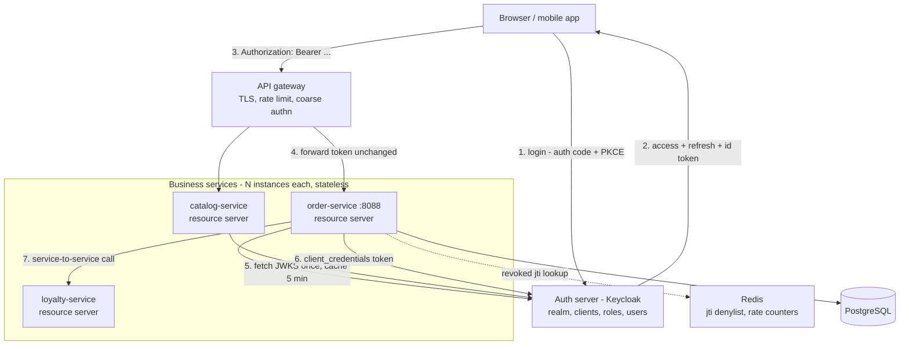
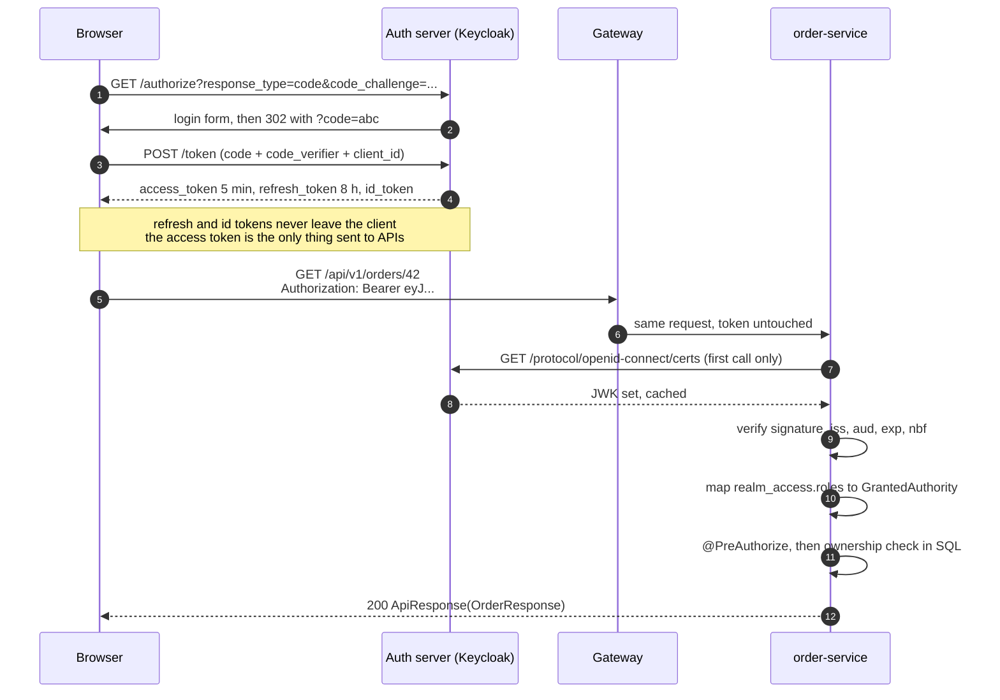
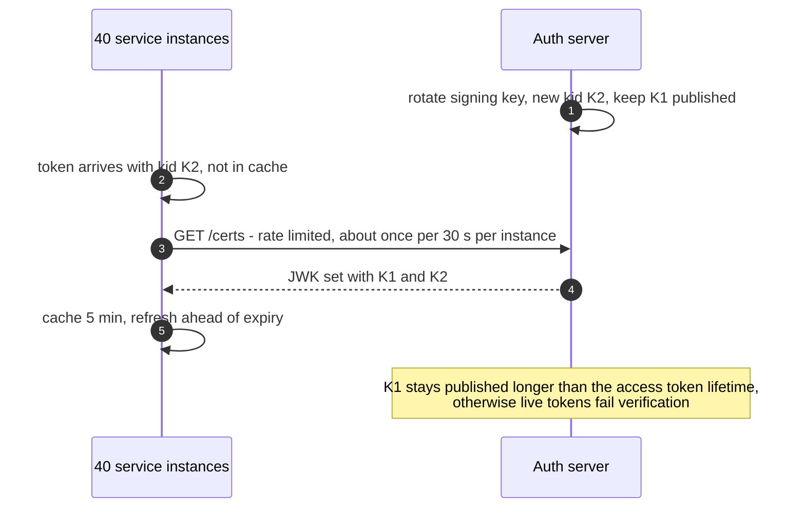
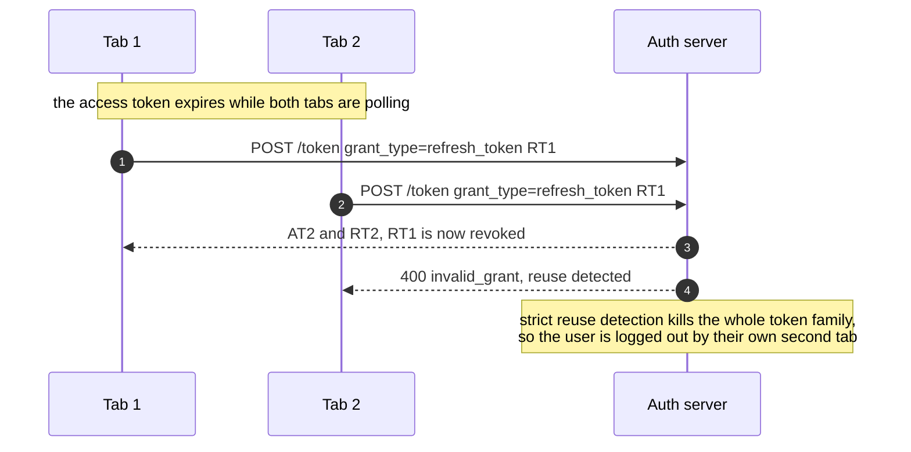

# How would you secure a REST API — authentication vs authorization flow?

Written for a **concurrent, multi-instance, microservice** deployment: authentication lives in a
**separate auth server** (Keycloak here), and every business service is a **stateless OAuth2
resource server**. Documentation only — the snippets are illustrative, and the last section maps
each concern onto [project2](../../../project2).

Rewritten from [`spring-security-authentication-authorization/readme.md`](../../../../spring-security-authentication-authorization/readme.md)
and [`keycloak/readme.md`](../../../../spring-security-authentication-authorization/keycloak/readme.md).

| Section | What it answers |
|---|---|
| [Answer](#answer) | the 60-second spoken version |
| [Architecture](#architecture) | who issues, who validates, who enforces |
| [Login and token issuance](#login-and-token-issuance) | browser to auth server to tokens |
| [Resource service validation](#resource-service-validation) | config, JWT vs introspection |
| [JWKS and key rotation](#jwks-and-key-rotation) | how a service trusts a new signing key |
| [Why sessions break on many instances](#why-sessions-break-on-many-instances) | sticky sessions, shared store, stateless |
| [Gateway vs per-service enforcement](#gateway-vs-per-service-enforcement) | where the filter goes |
| [Authorization levels](#authorization-levels) | roles, scopes, permissions, ownership |
| [Refresh rotation and races](#refresh-rotation-and-races) | the concurrency bug everyone hits |
| [Revocation and logout](#revocation-and-logout) | killing a token you cannot un-sign |
| [Service-to-service auth](#service-to-service-auth) | client credentials, propagation, mTLS |
| [Where this lives in project2](#where-this-lives-in-project2) | the files that would change |

## Answer

Authentication proves **who you are**; authorization decides **what you may do**. In a
microservice system they happen in two different places: a dedicated auth server authenticates the
user once and signs a short-lived access token, and every business service authorizes each request
from the claims in that token.

The services stay stateless, so any instance can serve any request. Each one verifies the token
signature locally against the auth server's public keys (JWKS), with no network call per request.

Access tokens are short, 2 to 5 minutes, because you cannot un-sign one. The refresh token stays
with the client and is rotated on every use.

Both the gateway and the service enforce. The gateway rejects garbage early, and the service is
the one that actually decides, because inside the cluster anyone can call it directly.

<!-- not in this repo -->
```xml
<dependency>
    <groupId>org.springframework.boot</groupId>
    <artifactId>spring-boot-starter-oauth2-resource-server</artifactId>
</dependency>
<!-- only in services that call other services with their own identity -->
<dependency>
    <groupId>org.springframework.boot</groupId>
    <artifactId>spring-boot-starter-oauth2-client</artifactId>
</dependency>
```

| Term | Question it answers | Where it runs | Failure code |
|---|---|---|---|
| Authentication | who is calling? | auth server, once per login | `401` + `WWW-Authenticate` |
| Token validation | is this token real and fresh? | every service, every request | `401` |
| Authorization | may this caller do this? | every service, per endpoint and per row | `403` |
| Auditing | who did it? | every service | — |

## Architecture

<!-- not in this repo -->


| Hop | Who decides | Why not elsewhere |
|---|---|---|
| 1-2 | auth server only | one place owns passwords, MFA, lockout and the signing key |
| 4 | gateway: token present, well-formed, not expired | cheap filter, kills bot traffic before it costs a pod |
| 5 | service: signature, `iss`, `aud`, `exp`, roles | a gateway-only check is bypassed by anything already inside the cluster |
| 6-7 | the service's own identity, not the user's | the callee must know whether it serves a user or a machine |

## Login and token issuance

<!-- not in this repo -->


| Grant | Use it for | Verdict |
|---|---|---|
| Authorization code + PKCE | browsers, SPAs, mobile | the default, and the only one to recommend today |
| Client credentials | service-to-service, cron jobs | correct for machines, never for users |
| Password (direct access grant) | Swagger UI, local dev | dropped in OAuth 2.1 — the app sees the password. Dev realm only |
| Implicit | nothing | dead. The token lands in the URL and in browser history |
| Refresh token | renewal without a new login | yes, with rotation turned on |

- The `id_token` is proof of login for the client. Never accept it as an API credential, because
  it is audienced to the client and not to your service.
- An SPA cannot keep a secret. Use the BFF pattern: tokens stay in a server-side session and the
  browser only gets a cookie.

## Resource service validation

<!-- not in this repo -->
```properties
# stateless JWT validation - no call to the auth server per request
spring.security.oauth2.resourceserver.jwt.issuer-uri=http://localhost:8080/realms/shop
spring.security.oauth2.resourceserver.jwt.audiences=order-service
# pin the algorithm so a token signed with none or HS256 cannot get in
spring.security.oauth2.resourceserver.jwt.jws-algorithms=RS256
```

<!-- not in this repo -->
```properties
# opaque tokens instead: one network call per request, instant revocation
spring.security.oauth2.resourceserver.opaquetoken.introspection-uri=http://localhost:8080/realms/shop/protocol/openid-connect/token/introspect
spring.security.oauth2.resourceserver.opaquetoken.client-id=order-service
spring.security.oauth2.resourceserver.opaquetoken.client-secret=${INTROSPECTION_SECRET}
```

| Choice | vs the alternative |
|---|---|
| `issuer-uri` | vs `jwk-set-uri`: the issuer form also discovers the endpoints and validates the `iss` claim. Use `jwk-set-uri` only when the auth server is unreachable at boot. |
| `audiences=order-service` | vs no audience check: without it a token minted for the loyalty service is accepted here. That is the confused-deputy bug. |
| `jws-algorithms=RS256` | vs trusting whatever the token header says: algorithm-confusion attacks live in that gap. |
| JWT, validated locally | vs introspection: no latency per call, but a token stays valid until `exp`. |
| Opaque token + introspection | vs JWT: revocation is instant, and you pay a round trip plus a hard dependency on the auth server on every request. |

<!-- not in this repo -->
```java
@Configuration
@EnableMethodSecurity
class SecurityConfig {

    @Bean
    SecurityFilterChain api(HttpSecurity http, AuthenticationEntryPoint problemEntryPoint)
            throws Exception {
        return http
            .securityMatcher("/api/**")
            .csrf(CsrfConfigurer::disable)                        // safe only because no cookie auth
            .sessionManagement(s -> s.sessionCreationPolicy(SessionCreationPolicy.STATELESS))
            .authorizeHttpRequests(auth -> auth
                .requestMatchers(HttpMethod.GET, "/api/v1/catalog/**").permitAll()
                .requestMatchers("/api/v1/orders/**").authenticated()
                .requestMatchers("/api/v1/admin/**").hasRole("ADMIN")
                .anyRequest().denyAll())                          // deny by default, not permitAll
            .oauth2ResourceServer(oauth -> oauth
                .authenticationEntryPoint(problemEntryPoint)      // 401 through GlobalExceptionHandler
                .jwt(jwt -> jwt.jwtAuthenticationConverter(keycloakConverter())))
            .build();
    }

    /** Keycloak puts roles in realm_access.roles, which Spring does not read on its own. */
    private JwtAuthenticationConverter keycloakConverter() {
        JwtAuthenticationConverter converter = new JwtAuthenticationConverter();
        converter.setJwtGrantedAuthoritiesConverter(jwt -> {
            Map<String, Object> realmAccess = jwt.getClaimAsMap("realm_access");
            if (realmAccess == null) {
                return List.of();
            }
            Collection<?> roles = (Collection<?>) realmAccess.getOrDefault("roles", List.of());
            return roles.stream()
                .map(role -> (GrantedAuthority) new SimpleGrantedAuthority("ROLE_" + role))
                .toList();
        });
        return converter;
    }
}
```

- `anyRequest().denyAll()` is the line that saves you. A controller someone adds next sprint stays
  closed until it is opened on purpose.
- The converter has to add the `ROLE_` prefix, because `hasRole("ADMIN")` looks for `ROLE_ADMIN`
  while the token carries plain `ADMIN`.

`GET /api/v1/orders/42` with no token →

```json
{
  "success": false,
  "status": 401,
  "error": { "code": "UNAUTHENTICATED", "message": "Bearer token is missing or expired" }
}
```

## JWKS and key rotation

<!-- not in this repo -->


| Knob | Default in Spring Security's `NimbusJwtDecoder` | Why it matters |
|---|---|---|
| JWK set cache | 5 minutes, refreshed ahead of expiry | one fetch per instance per 5 minutes instead of one per request |
| Unknown `kid` lookup | rate limited, roughly one per 30 seconds | this is the anti-stampede guard. Forty instances fetching `/certs` on every request would take the auth server down with your own traffic |
| Clock skew | 60 seconds of leeway on `exp` and `nbf` | a token from a node whose clock runs a few seconds fast is still accepted |

- Overlap the old key. Publish K1 next to K2 for longer than the access token lifetime, or every
  token signed a minute ago dies at rotation.
- Warm the decoder at startup so the first real user does not pay for the JWKS fetch.

## Why sessions break on many instances

<!-- not in this repo -->
```text
   HttpSession in memory (the broken one)        Stateless bearer token (the fix)

   LB --> pod A  [session S1: user=42]           LB --> pod A  \
   LB --> pod B  [empty]                         LB --> pod B   >  all read user=42
   LB --> pod C  [empty]                         LB --> pod C  /   from the token itself

   pod A dies -> that user is logged out         pod A dies -> next request just works
   deploy     -> everyone is logged out          deploy     -> nobody notices
   scale out  -> cold pod, those users get 401   scale out  -> instant capacity
```

| Approach | What breaks | Use when |
|---|---|---|
| In-memory `HttpSession` + sticky sessions | restart, deploy and autoscale all log users out, and the load balancer can no longer rebalance | a single instance, never in production |
| Shared session store (Spring Session + Redis) | Redis becomes a hard dependency and a hot key on every request, but sessions survive restarts | server-rendered apps, or a BFF holding tokens for a browser |
| Stateless JWT | there is no server-side state to revoke, so logout is best effort until `exp` | REST APIs and microservices, which is this doc's choice |

- `SessionCreationPolicy.STATELESS` is not decoration. Without it one stray `getSession()` call
  makes the service stateful again, and that only fails behind a load balancer.
- If you do use a shared store, watch the payload size. Deserializing 40 KB of authorities from
  Redis per request costs more than verifying a signature.

## Gateway vs per-service enforcement

| Concern | Gateway | Service |
|---|---|---|
| TLS termination, rate limiting, CORS | yes | no |
| Token present and parseable | yes, fail fast | yes, again |
| Signature, `iss`, `aud`, `exp` | yes | **yes, and this one is mandatory** |
| Roles and scopes per endpoint | coarse path rules only | yes |
| Row-level ownership | impossible, it has no data | yes |
| Trusting `X-User-Id` from upstream | — | only with mTLS, and strip the inbound header first |

Rule of thumb: the gateway is a filter, the service is the decision point. East-west traffic never
passes the gateway at all.

## Authorization levels

<!-- not in this repo -->
```java
@RestController
@RequestMapping("/api/v1/orders")
@RequiredArgsConstructor
public class OrderController {

    private final OrderService orderService;

    /** Coarse: any authenticated user may ask, and the service decides whose rows come back. */
    @GetMapping
    public ApiResponse<Page<OrderResponse>> findMine(@AuthenticationPrincipal Jwt jwt,
                                                     Pageable pageable) {
        return ApiResponse.ok(orderService.findByOwner(jwt.getSubject(), pageable));
    }

    /** Role check: a refund is a back-office action. */
    @PostMapping("/{id}/refund")
    @PreAuthorize("hasRole('SUPPORT')")
    public ApiResponse<OrderResponse> refund(@PathVariable Long id) {
        return ApiResponse.ok(orderService.refund(id));
    }

    /** Scope is what the client app may do; the role is what the person may do. Check both. */
    @DeleteMapping("/{id}")
    @PreAuthorize("hasAuthority('SCOPE_orders:write') and hasRole('ADMIN')")
    public ApiResponse<Void> delete(@PathVariable Long id) {
        orderService.delete(id);
        return ApiResponse.ok(null);
    }
}
```

<!-- not in this repo -->
```java
@Override
@Transactional(readOnly = true)
public OrderResponse findById(Long id, String subject) {
    // Ownership is data, so only the service can decide it. Filter in SQL, never load then check.
    Order order = orderRepository.findByIdAndUserSubject(id, subject)
        .orElseThrow(() -> new BusinessException("ORDER_NOT_FOUND", "Order " + id + " not found"));
    return orderMapper.toResponse(order);
}
```

- Return **404, not 403**, when someone asks for another user's order. A 403 confirms the row
  exists, which is a free enumeration oracle.
- Push the ownership predicate into the query. `findById(id)` plus an `if` still reads the row,
  and one careless refactor later it gets returned.

| Level | Carried in | Granularity | Changes when |
|---|---|---|---|
| Role (`ROLE_ADMIN`) | `realm_access.roles` | whole endpoints | the user's job changes |
| Scope (`SCOPE_orders:write`) | the `scope` claim | what the client app may do for the user | the consent screen changes |
| Permission (`orders:refund:eu`) | a custom claim, or a lookup | per feature | often, so keep it out of the token if it churns |
| Ownership (`order.user == sub`) | your database | per row | every request |

- Put small, stable facts in the token. A token carrying 300 permissions is slow to sign, slow to
  parse, and stale the moment an admin edits a role.

## Refresh rotation and races

<!-- not in this repo -->


| Mitigation | Cost |
|---|---|
| Single-flight in the client: one refresh in progress, everyone else awaits the same promise | none, and this is the real fix. It belongs in the HTTP interceptor |
| A few seconds of grace on the old refresh token, one reuse allowed | weakens reuse detection a little, saves a lot of support tickets |
| Cross-tab lock (`BroadcastChannel`, shared worker) | browser only, and fiddly |
| No rotation at all | a stolen refresh token then works for its whole lifetime. Do not |

| Concurrency pitfall | What it looks like in production | Fix |
|---|---|---|
| Refresh race | random logouts, worse on flaky networks | single-flight plus a grace window |
| Replay of a captured token | the same `jti` used from two IPs | short `exp`, TLS everywhere, sender-constrained tokens (DPoP or mTLS) for high-value APIs |
| Clock skew | `401` on freshly issued tokens, and only on one node | NTP on every host, keep the 60 second leeway |
| JWKS stampede | auth server CPU spikes the moment a key rotates | rate-limited JWK source, cache, overlapping keys |
| Denylist hot key | every request hits the same Redis key | check only `jti`s that a bloom filter flags, or accept a short `exp` instead |

## Revocation and logout

| Need | Mechanism | Honest trade-off |
|---|---|---|
| Log out this device | client drops its tokens and calls `/logout` with the refresh token | the access token still works until `exp` |
| Log out everywhere | the auth server ends the SSO session and posts a `logout_token` to each service (OIDC back-channel logout) | every service must implement that endpoint and keep a `sid` map |
| Kill one token now | a `jti` denylist in Redis, TTL equal to the remaining lifetime | a lookup per request, so you are half stateful again |
| Kill all of a user's tokens | store `tokens_valid_after` per user and compare it with `iat` | one cached lookup per user instead of per token |
| Disable an account | the auth server refuses the refresh | this is why access tokens are 2 to 5 minutes |

Short expiry is the primary control. A denylist is what you add when "up to 5 minutes" is not an
acceptable answer for your domain.

## Service-to-service auth

<!-- not in this repo -->
```properties
spring.security.oauth2.client.registration.loyalty.provider=keycloak
spring.security.oauth2.client.registration.loyalty.authorization-grant-type=client_credentials
spring.security.oauth2.client.registration.loyalty.client-id=order-service
spring.security.oauth2.client.registration.loyalty.client-secret=${ORDER_SERVICE_SECRET}
spring.security.oauth2.client.provider.keycloak.token-uri=http://localhost:8080/realms/shop/protocol/openid-connect/token
```

<!-- not in this repo -->
```java
@Bean
RestClient loyaltyClient(RestClient.Builder builder, OAuth2AuthorizedClientManager manager) {
    OAuth2ClientHttpRequestInterceptor interceptor = new OAuth2ClientHttpRequestInterceptor(manager);
    interceptor.setClientRegistrationIdResolver(request -> "loyalty");
    return builder
        .baseUrl("http://loyalty-service:8080")
        .requestInterceptor(interceptor)   // caches the token until it expires
        .build();
}
```

| Pattern | Who the callee sees | Use when |
|---|---|---|
| Token propagation, forwarding the user's token | the end user | the downstream call is on the user's behalf and must respect their permissions |
| Client credentials | the calling service | background jobs, cron, event consumers, where there is no user |
| mTLS or SPIFFE | the workload itself | you want transport-level identity too, or zero trust between pods |
| A shared API key header | nothing useful | never. It cannot expire, rotate or be audited |

- Propagating the user's token is convenient and leaky. The downstream service can replay it
  against anything in the same audience, so narrow the `aud` or exchange the token (RFC 8693).
- The authorized-client manager caches and refreshes client-credentials tokens for you. Minting a
  fresh one per outbound call is a classic throughput killer.

## Comparison

| Aspect | Authentication | Authorization |
|---|---|---|
| Question | who are you? | what may you do? |
| Runs | once per login, in the auth server | on every request, in every service |
| Input | password, MFA, social login, client secret | the validated claims plus your own data |
| Output | tokens | allow or deny |
| Spring piece | `JwtDecoder`, `AuthenticationManager` | `authorizeHttpRequests`, `@PreAuthorize`, ownership queries |
| Status code | `401`, we do not know you | `403`, we know you and the answer is no |
| Performance | expensive, done rarely | must be microseconds, done constantly |
| Failure mode | nobody can log in, and it is loud | the wrong person reads the wrong row, silently |

## Pitfalls

| Pitfall | Why it hurts |
|---|---|
| No `aud` check | any valid token in the realm opens every service |
| Long-lived access tokens | a leaked token works for hours and you cannot recall it |
| `permitAll()` as the fallback rule | the next controller ships wide open |
| Trusting a gateway header such as `X-User-Id` | anything inside the cluster can spoof it |
| Reading roles by hand from `jwt.getClaim(...)` in a controller | the check gets forgotten on endpoint 41 |
| `403` for another user's row | it tells the attacker the row exists |
| Secrets in `application.properties` | they land in git. Use environment variables or a secret manager |
| Keeping `HttpSession` state next to JWT auth | works on one instance, fails behind a load balancer |
| Not overlapping signing keys on rotation | every live token fails at the same moment |
| `@PreAuthorize` on a private or self-invoked method | the proxy never runs, so the rule silently does nothing |
| Storing tokens in `localStorage` | any XSS becomes a full account takeover |
| Password grant in production | your app handles the password, and MFA becomes impossible |

## Follow-up questions

**Why not just use sessions?** They pin a user to one instance, or need a shared store on the hot
path. Tokens make every instance interchangeable.

**How do you revoke a JWT?** You cannot un-sign it. Keep `exp` short, and add a `jti` denylist if
minutes are too long for your domain.

**JWT or opaque token?** JWT for internal APIs where latency matters. Opaque with introspection
when instant revocation is a hard requirement.

**Where do you validate, gateway or service?** Both. The gateway filters, the service decides,
because internal callers skip the gateway.

**How does a service get the public key?** From the JWKS endpoint under `issuer-uri`, cached and
refreshed. No key material ships with the app.

**401 or 403?** Missing or bad credentials is `401`. Valid credentials but not allowed is `403`.
For another user's data, prefer `404`.

**How do you test this?** `@WithMockUser` for role rules, and
`SecurityMockMvcRequestPostProcessors.jwt()` with custom claims for resource-server rules. Neither
touches the real auth server.

**What about CSRF?** The browser does not attach bearer tokens automatically, so CSRF is off for
the API chain. Put tokens in cookies and you must turn it back on.

**What does the client do on a 401?** Refresh once, then retry the request. If the refresh fails,
send the user back to login.

**Multi-tenant?** Put `tenant_id` in the token, check it against the route, and filter every query
by it. Never read the tenant from a request parameter.

## Where this lives in project2

Nothing here is implemented. This is the map if it were.

| Concern | File or package in [project2](../../../project2) |
|---|---|
| `SecurityConfig`, the JWT converter, the entry point | [`config/`](../../../project2/src/main/java/com/example/project2/config) |
| Issuer, audience and algorithm properties | [`application.properties`](../../../project2/src/main/resources/application.properties) |
| The loosened dev realm, password grant for Swagger | [`application-dev.properties`](../../../project2/src/main/resources/application-dev.properties) |
| `@PreAuthorize` on endpoints | [`OrderController.java`](../../../project2/src/main/java/com/example/project2/controller/OrderController.java) |
| Ownership filtering inside the query | [`service/impl/`](../../../project2/src/main/java/com/example/project2/service/impl), [`repository/`](../../../project2/src/main/java/com/example/project2/repository) |
| `401` and `403` rendered as `ApiResponse` | [`GlobalExceptionHandler.java`](../../../common-lib/src/main/java/com/example/commonlib/exception/GlobalExceptionHandler.java) |
| OAuth2 flows in Swagger UI | [`SwaggerConfig.java`](../../../common-lib/src/main/java/com/example/commonlib/config/SwaggerConfig.java) |

## Try it

```bash
# 1. a throwaway auth server, in memory, dev only
docker run --rm -p 8080:8080 \
  -e KC_BOOTSTRAP_ADMIN_USERNAME=admin -e KC_BOOTSTRAP_ADMIN_PASSWORD=admin \
  quay.io/keycloak/keycloak:26.0 start-dev

# 2. the public keys every resource server would cache
curl -s localhost:8080/realms/master/protocol/openid-connect/certs | jq '.keys[].kid'

# 3. a machine token via client credentials, then read its claims
TOKEN=$(curl -s -d grant_type=client_credentials \
  -d client_id=order-service -d client_secret=CHANGE_ME \
  localhost:8080/realms/shop/protocol/openid-connect/token | jq -r .access_token)
echo "$TOKEN" | cut -d. -f2 | base64 -d | jq '{iss, aud, exp, realm_access, scope}'

# 4. what a secured resource server would answer - 401 without, 200 with
curl -i localhost:8088/api/v1/orders/42
curl -i -H "Authorization: Bearer $TOKEN" localhost:8088/api/v1/orders/42
```

## References

- [Spring Security — OAuth2 resource server, JWT](https://docs.spring.io/spring-security/reference/servlet/oauth2/resource-server/jwt.html)
- [Spring Security — method security](https://docs.spring.io/spring-security/reference/servlet/authorization/method-security.html)
- [Spring Security — OAuth2 client, authorization grants](https://docs.spring.io/spring-security/reference/servlet/oauth2/client/authorization-grants.html)
- [RFC 9700 — best current practice for OAuth 2.0 security](https://datatracker.ietf.org/doc/html/rfc9700)
- [RFC 7662 — token introspection](https://datatracker.ietf.org/doc/html/rfc7662), [RFC 8693 — token exchange](https://datatracker.ietf.org/doc/html/rfc8693)
- [OpenID Connect back-channel logout](https://openid.net/specs/openid-connect-backchannel-1_0.html)
- [Keycloak — server administration guide](https://www.keycloak.org/docs/latest/server_admin/index.html)
- Source material in this repo: [`spring-security-authentication-authorization/readme.md`](../../../../spring-security-authentication-authorization/readme.md), [`keycloak/readme.md`](../../../../spring-security-authentication-authorization/keycloak/readme.md)
- Related, other topic folder: [rest-api/03-global-exception-handling.md](../rest-api/03-global-exception-handling.md), [rest-api/04-idempotency-in-rest-apis.md](../rest-api/04-idempotency-in-rest-apis.md), [architecture/01-spring-modulith-modular-monolith.md](../architecture/01-spring-modulith-modular-monolith.md)
